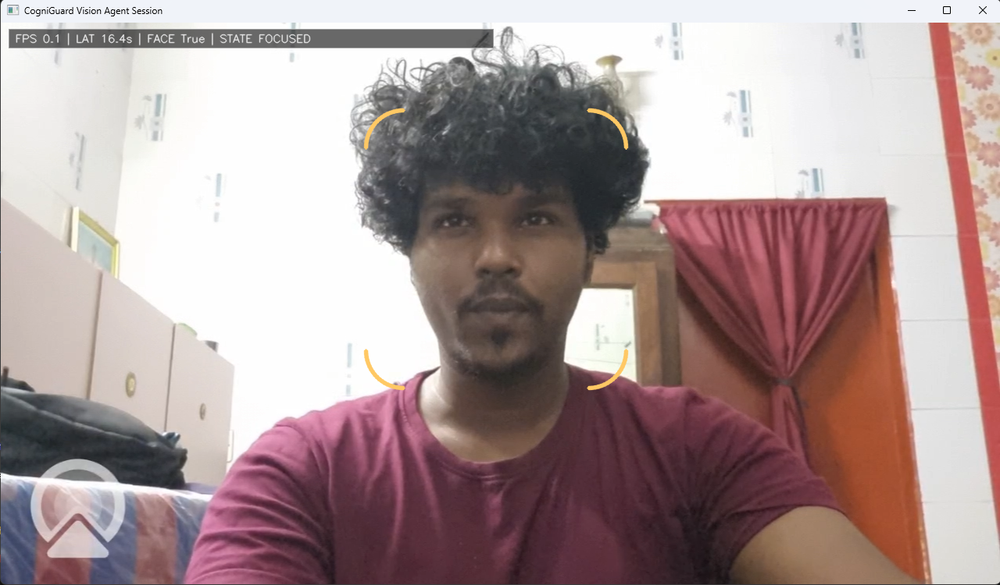
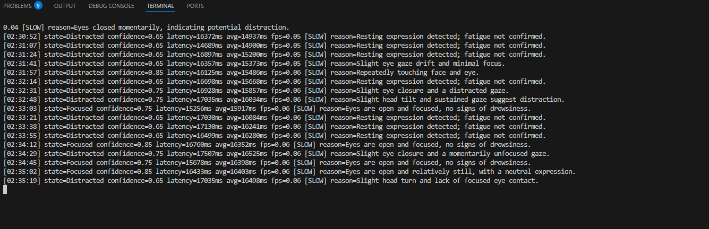
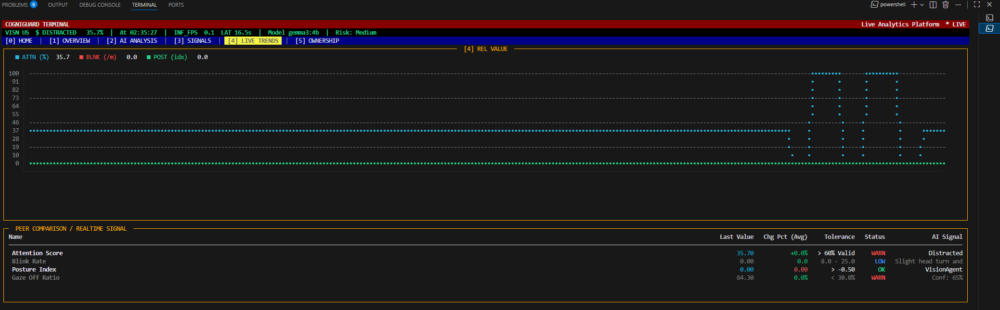

# CogniGuard Vision Agent

Realtime AI vision monitoring application for cognitive-state understanding from live webcam streams. CogniGuard combines OpenCV capture, Vision Agents SDK reasoning, and live UI/TUI analytics for hackathon-grade demos and practical monitoring workflows.

## Overview

CogniGuard performs continuous webcam analysis and produces structured AI decisions in realtime:

- `Focused`
- `Distracted`
- `Fatigued`

The system includes:

- A realtime webcam monitoring UI (`main.py`)
- A native Vision Agents SDK runtime (`vision_agent_session.py`)
- A Bloomberg-style terminal analytics dashboard (`tui_dashboard.py`)
- A minimal web deployment endpoint for public demo links (`web_demo.py`)

## System Architecture

```text
+------------------+      +-----------------------+      +------------------------+
|      Webcam      | ---> |  OpenCV Frame Capture | ---> | Vision Agents SDK Core |
+------------------+      +-----------------------+      +-----------+------------+
                                                                      |
                                                                      v
                                                        +-----------------------------+
                                                        | Local / Cloud Vision LLM    |
                                                        | (e.g., Gemma3, MiniMax M2)  |
                                                        +--------------+--------------+
                                                                       |
                                                                       v
                                                        +-----------------------------+
                                                        | Structured AI Output JSON   |
                                                        | state/confidence/reason/... |
                                                        +------+----------------------+
                                                               | 
                                 +-----------------------------+------------------------------+
                                 |                                                            |
                                 v                                                            v
                    +-----------------------------+                              +------------------------------+
                    | Realtime Monitoring UI      |                              | TUI Analytics Dashboard      |
                    | main.py (OpenCV overlay)    |                              | tui_dashboard.py (Rich)      |
                    +-----------------------------+                              +------------------------------+
```

## Processing Pipeline

| Stage | Input | Processing | Output |
|---|---|---|---|
| 1. Capture | Webcam stream | OpenCV frame acquisition | Raw BGR frames |
| 2. Tracking | Raw frames | Face/pose + tracker logic | Attention/fatigue signals |
| 3. Vision Reasoning | Current frame + prompt | Vision Agents SDK + LLM inference | AI state decision |
| 4. Structuring | Model response | JSON parsing + normalization | `state`, `confidence`, `reason`, `latency_ms`, `fps` |
| 5. State Bridge | Structured decision | Atomic write to `vision_state.json` | Shared realtime state |
| 6. UI Rendering | Bridge JSON + metrics | HUD/glass overlays + trackers | Visual operator interface |
| 7. Dashboard Rendering | Bridge JSON + metrics | Rich TUI panels + trend chart | Terminal analytics view |

## Features

| Feature | Description |
|---|---|
| Realtime Camera Inference | Continuous frame processing using OpenCV |
| Vision Agents SDK Runtime | Native SDK-based session for vision reasoning |
| Structured AI Output | Standardized state, confidence, reason, latency |
| Face Tracking Overlay | Cinematic tracking brackets and smooth lock behavior |
| Cognitive State Classification | Focused / Distracted / Fatigued decisions |
| Live Monitoring UI | Realtime on-camera metrics and state display |
| Rich TUI Dashboard | Dense analytics terminal with trends and risk indicators |
| Shared State Bridge | JSON file bridge for UI/TUI synchronization |
| Render Web Demo | Deployable Flask endpoint for public project link |

## Vision Agents SDK Usage

CogniGuard uses the Vision Agents SDK as the reasoning engine for realtime frame-level analysis.

Core workflow:

1. Capture webcam frames with OpenCV.
2. Feed frame stream into Vision Agents session.
3. Prompt model to classify cognitive state.
4. Parse and normalize structured output.
5. Publish latest decision to `vision_state.json`.

Structured output format:

```json
{
  "state": "Focused | Distracted | Fatigued",
  "confidence": 0.0,
  "reason": "Short AI explanation",
  "latency_ms": 6200,
  "fps": 8.4,
  "model": "your LLM",
  "timestamp": "2026-02-28T15:21:32Z"
}
```

## Realtime Monitoring UI

`main.py` provides the operator-facing webcam UI with:

- Realtime visual tracker overlays
- Cognitive state and confidence display
- Aggregated behavioral indicators (attention, blink, gaze, posture)
- Smooth transitions and low-latency updates

### Realtime Vision Monitoring



## Analytics Dashboard

`tui_dashboard.py` renders a professional Rich-based terminal view including:

- Live state/risk strip
- Multi-metric trend plotting
- Relative signal comparison table
- Low-latency, dense monitoring layout

### Vision Agent Runtime



### Realtime Analytics Dashboard



## Example Output

```text
[15:12:00] state=Focused confidence=0.85 latency=1756ms reason=Stable gaze and upright posture.
```

```json
{
  "state": "Focused",
  "confidence": 0.85,
  "reason": "Stable gaze and upright posture",
  "latency_ms": 1756,
  "fps": 8.9,
  "model": "gemma3:4b",
  "timestamp": "2026-03-01T15:12:00Z"
}
```

## File Structure

```text
Vision_Agent/
+-- main.py
+-- vision_agent_session.py
+-- vision_tools.py
+-- tui_dashboard.py
+-- web_demo.py
+-- camera_test.py
+-- requirements.txt
+-- face_landmarker.task
+-- pose_landmarker.task
+-- vision_state.json                # runtime-generated
+-- cogniguard_metrics.json          # runtime-generated
+-- sessions/                        # runtime logs
+-- images/
¦   +-- webcam_ui.png
¦   +-- vision_agent_terminal.png
¦   +-- dashboard.png
+-- README.md
```

## Installation

### Prerequisites

- Python 3.10+ (recommended)
- Webcam source (physical cam / Camo / virtual cam)
- Optional local model runtime via Ollama (`http://127.0.0.1:11434/v1`)

### Install dependencies

```powershell
python -m pip install --upgrade pip
python -m pip install opencv-python mediapipe numpy rich flask requests aiortc av vision-agents vision-agents-plugins-openai
```

## Running Instructions

Run as a 3-process realtime system.

### 1) Vision Agent Session (core reasoning runtime)

```powershell
cd D:\Coding\Vision_Agent
$env:OPENAI_BASE_URL="http://127.0.0.1:11434/v1"
$env:OPENAI_API_KEY="local-required"
$env:VISION_AGENT_MODEL="gemma3:4b"
$env:VISION_AGENT_CAMERA_INDEX="0"
python vision_agent_session.py
```

### 2) Realtime UI

```powershell
cd D:\Coding\Vision_Agent
python main.py
```

### 3) TUI Dashboard

```powershell
cd D:\Coding\Vision_Agent
python tui_dashboard.py
```

## Deployment

Render deployment is provided through a minimal Flask app (`web_demo.py`) to produce a public hackathon link.

- Platform: Render (Web Service)
- Build Command: `pip install -r requirements.txt`
- Start Command: `python web_demo.py`
- Endpoint: `https://cogniguard-z5l2.onrender.com`

Expected browser response:

```json
{
  "project": "CogniGuard Vision Agent",
  "status": "Running",
  "description": "Realtime AI Vision Monitoring using Vision Agents SDK and local Gemma3 model"
}
```

## Use Cases

- Driver fatigue monitoring
- Workplace safety monitoring
- Human attention analytics
- Smart environment monitoring

## Technical Stack

| Layer | Technology | Purpose |
|---|---|---|
| Language | Python | Core application runtime |
| Vision I/O | OpenCV | Webcam capture and rendering |
| Landmark Signals | MediaPipe | Face/pose-based signal extraction |
| Agent Framework | Vision Agents SDK | Realtime vision reasoning orchestration |
| LLM Backend | Local/Cloud model (Gemma/MiniMax/Qwen) | Cognitive-state classification |
| Async Runtime | asyncio | Non-blocking session/inference loops |
| Terminal UI | Rich | Professional analytics dashboard |
| Deployment | Flask + Render | Public demo endpoint |

---

CogniGuard Vision Agent is designed for realtime, explainable, and deployment-ready cognitive monitoring demonstrations.
